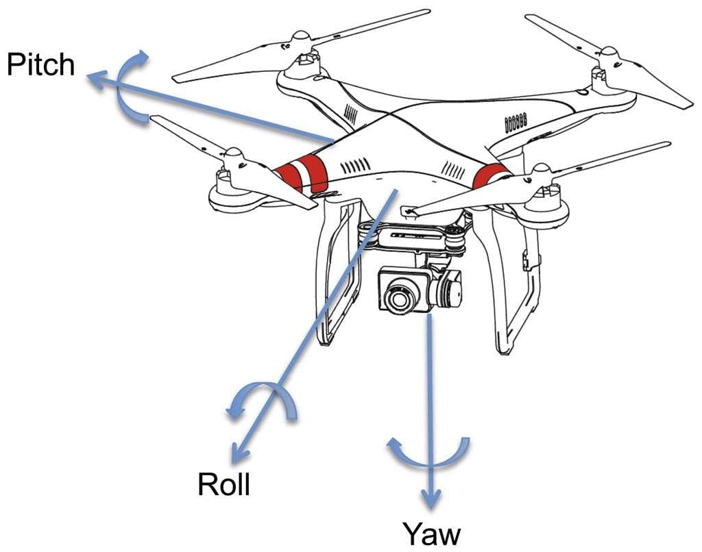
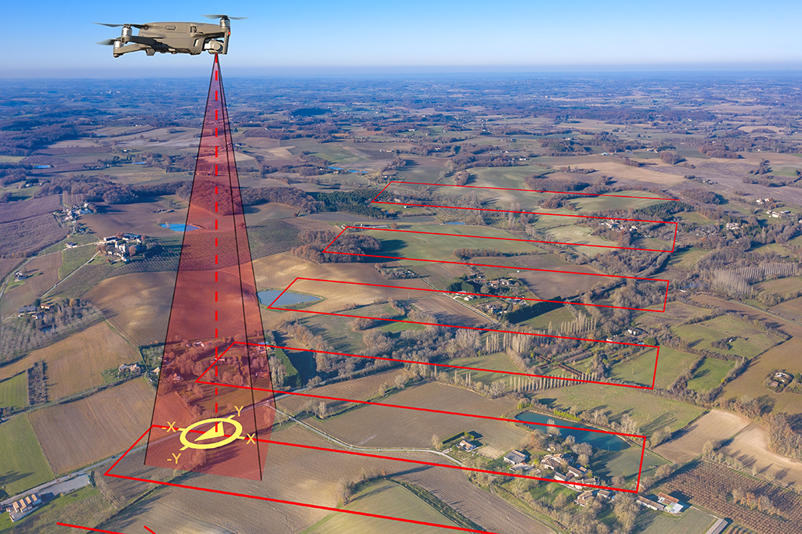
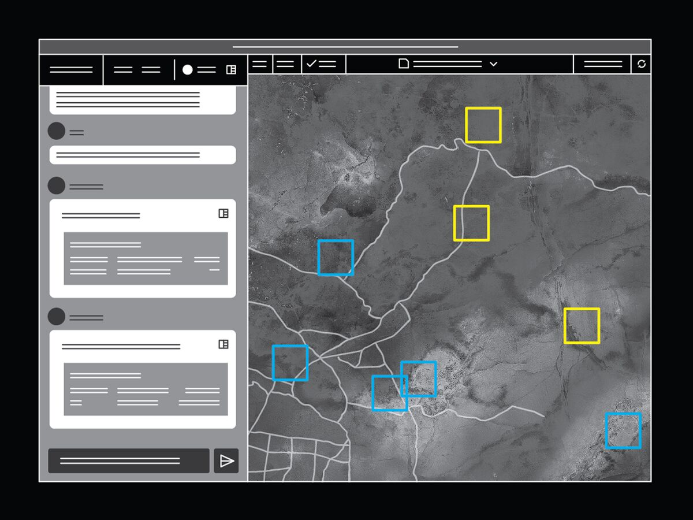
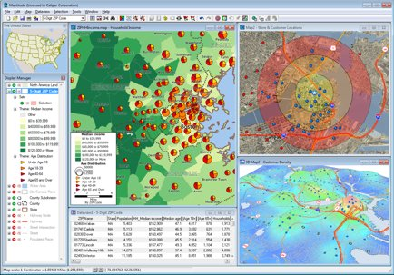

# Project Panoptes

## Problem statement

On the modern, dynamic battlespace, accurate, real-time information is critical for effective operations. Drones have been deployed to good effect for surveillance, but they still rely mainly on human operator photo-interpretation, a critical slow-down in the observe-orient part of the OODA loop.

High-accuracy drone photogrammetry can accurately map objects on the ground. However, such systems are typically expensive and fragile, unsuited for the chaos of frontlines.

## Project idea

The project aims to present a low-cost commercial off-the-shelf solution to drone photogrammetry. It requires a single camera calibration step, after which photos taken by the drone in-flight can be analyzed. Objects of interest captured on photos are then detected by an open-source computer vision system. These are then mapped to their geolocations via photogrammetry.

Separately, a battlespace GIS display ("The Overseer") synthesizes the location of known objects of interest (OoI), such as friendly troops, enemy troops, natural landmarks, etc. It also displays unconfirmed objects inferred by photogrammetry. The operator can click on unconfirmed OoI, which would then show the drone photos and footage for the OoI. The operator can confirm or disconfirm the identification.

Another, somewhat unrelated idea that we tested, was to use celestial navigation without satellite-based GNSS. That is, the drone captures an image of the night sky, and use the locations of the stars to infer its longitude and latitude.

## Drone photogrammetry

The drone photogrammetry package constructs an object `DroneCamera`, which represents the intrinsic geometry of a drone equipped with a camera. It assumes that the camera has fixed intrinsics (focal length and lens distortion), and that the camera is securely fixed on the drone (that is, its position and orientation relative to the drone is fixed).

It first performs calibration by taking a single image of a checkerboard calibration pattern with the camera pointing face-down. Once calibrated, it can use back-projection to find the position and direction of the light ray corresponding to any pixel on any image. To perform back-projection, the image must be tagged with the drone position, roll, pitch, and yaw angles, at the instance when the image is taken.

By intersecting the light ray with the local topographic map, any object of interest captured in images can be mapped to the ground. Right now, we are assuming the local terrain is flat at $z = 0$. We expect to extend this with a GIS, so that we can compute with any terrain, not just flat ones.

## User journey

Before the first light, a drone tactical unit arrives on the front line. Daylight maneuvers has become too dangerous due to the loitering drones. Settling into a camouflaged dugout, nicknamed "Drone King's Nest", they unpack and set up the gear.

The drone technician places a tall rectangular shelf with a single opening on top. On the shelf there is a little LCD display showing three numbers "row, pitch, yaw". The technician rotates the shelf and turns some nuts until the three numbers read zeros. He calls out "all balls".

He takes out a drone from a box, places it on the top of the shelf so that the camera looks through the opening, and inserts a small cable into its side. He presses a button, a single "beep", and he pulls the cable off the drone. The drone's camera is calibrated. He repeats this for every drone in the box.

The drone operators place 4 drones on the launch pads placed outside the dugout. At the dawn of day, they take off and start following a preplanned scouting trajectory.

As they survey, they send back images (tagged with their geolocations and drone pose estimates) back to the ground station server, where a server matches these images with known images of the ground to improve the geolocations and pose estimates. It then runs a neural network to find potential objects of interest, such as trucks, anti-air defense systems, etc. Each object is located on the map using drone photogrammetry.

As the server performs this task, it updates a list of objects of interest, their inferred locations, and photographs of these. This is displayed on a single unified dashboard display ("The Overseer") showing a real-time local map, with multicolored squares, triangles, circles, etc, showing threats, drones, known friendly units, suspected hostile units, etc.

There are also overlapping half-circles and polygons in warning red, marking out regions of anti-drone fire. The operator can click on any symbol and out pops the drone photos taken for that object.

